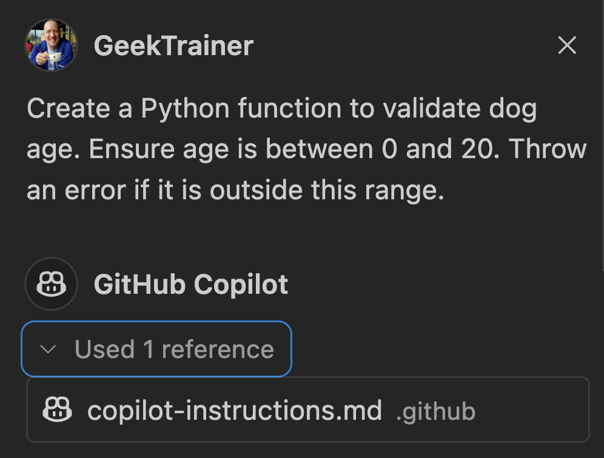

# Providing custom instructions

| [← Coding with GitHub Copilot][walkthrough-previous] | [Next: Add the filter feature →][walkthrough-next] |
|:-----------------------------------|------------------------------------------:|

There are always key pieces of information anyone generating code for your codebase needs to know - the technologies in use, coding standards to follow, project structure, etc. Since context is so important, as we've discussed, we likely want to ensure Copilot always has this information as well. Fortunately, we can provide this overview through the use of Copilot instructions.

## Scenario

Before we begin larger updates to the site with the help of Copilot, we want to ensure Copilot has a good understanding of how we're building our application. As a result, we're going to add a Copilot instructions file to the repository.

## Overview of Copilot instructions

Copilot instructions is a markdown file is placed in your **.github** folder. It becomes part of your project, and in turn to all contributors to your codebase. You can use this file to indicate various coding standards you wish to follow, the technologies your project uses, or anything else important for Copilot Chat to understand when generating suggestions.

> [!IMPORTANT]
> The *copilot-instructions.md* file is included in **every** call to GitHub Copilot Chat, and will be part of the context sent to Copilot. Because there is always a limited set of tokens an LLM can operate on, a large Copilot instructions file can obscure relevant information. As such, you should limit your Copilot instructions file to project-wide information, providing an overview of what you're building and how you're building it. If you need to provide more specific information for particular tasks, you can create [prompt files](https://docs.github.com/en/copilot/customizing-copilot/adding-repository-custom-instructions-for-github-copilot?tool=vscode#about-prompt-files).

Here are some guidelines to consider when creating a Copilot instructions file:

- The Copilot instructions file becomes part of the project, meaning it will apply to every developer; anything indicated in the file should be globally applicable.
- The file is markdown, so you can take advantage of that fact by grouping content together to improve readability.
- Provide overview of **what** you are building and **how** you are building it, including:
    - languages, frameworks and libraries in use.
    - required assets to be generated (such as unit tests) and where they should be placed.
    - any language specific rules such as:
        - utilize [type hints][type-hints] in Python.
        - use [arrow functions][arrow-functions] rather than the `function` keyword in TypeScript.
- If you notice GitHub Copilot consistently provides an unexpected suggestion (e.g. using class components for React), add those notes to the instructions file.

## Create a Copilot instructions file

Let's create a Copilot instructions file. We'll start by asking Copilot to generate a block of code, then add the instructions file, then ask the same question again to see the changes.

1. Return to your IDE with your project open.
2. Close any tabs you may have open in your IDE to ensure Copilot chat has an empty context.
3. Select the `+` icon towards the top of Copilot chat to begin a new chat.
4. Open Copilot Chat and send the following prompt:

    ```
    Create a Python function to validate dog age. Ensure age is between 0 and 20. Throw an error if it is outside this range.
    ```

5. Note the function signature is similar to `def validate_dog_age(age)` without type hints.

> [!NOTE]
> Because LLMs are probabilistic rather than deterministic, the exact code will vary.

6. Create a new file in the **.github** folder called **copilot-instructions.md**.
7. Add the markdown to the file necessary which provides information about the project structure and requirements:

    ```markdown
    # Dog shelter

    This is an application to allow people to look for dogs to adopt. It is built in a monorepo, with a Flask-based backend and Astro-based frontend.

    ## Backend

    - Built using Flask and SQLAlchemy
    - Use type hints

    ## Frontend

    - Built using Astro and Svelte
    - TypeScript should use arrow functions rather than the function keyword
    - Pages should be in dark mode with a modern look and feel
    ```

8. **Save** the file.

## Watch the instructions file in action

Whenever you make a call to Copilot chat, the references dialog indicates all files used to generate the response. Once you create a Copilot instructions file, you will see it's always included in the references section. Since you included directions to use type hints, you'll notice the code suggestions will follow this guidance.

1. Close all files currently open in VS Code or your Codespace. (This will ensure we are working with an empty context.)
2. Select the `+` icon in GitHub Copilot chat to start a new chat.
3. Send Copilot chat the same prompt you used previously:

    ```
    Create a Python function to validate dog age. Ensure age is between 0 and 20. Throw an error if it is outside this range.
    ```

> [!TIP]
> You can use up arrow to resend previous prompts to Copilot chat.

4. Note the references now includes the instructions file and provides information gathered from it.

    

5. Note the resulting Python now utilizes type hints, and the function signature will resemble the following:

    ```python
    def validate_dog_age(age: int):
    ```

> [!NOTE]
> The exact code generated will vary, but the new Python suggestion should now utilize type hints.

## Summary and next steps

Copilot instructions improves the quality of suggestions, and ensures better alignment with the desired practices you have in place. With the groundwork in place, let's [add new functionality to our website][walkthrough-next]!

## Resources

- [Adding repository custom instructions for GitHub Copilot][custom-instructions]


| [← Coding with GitHub Copilot][walkthrough-previous] | [Next: Add the filter feature →][walkthrough-next] |
|:-----------------------------------|------------------------------------------:|

[arrow-functions]: https://developer.mozilla.org/en-US/docs/Web/JavaScript/Reference/Functions/Arrow_functions
[custom-instructions]: https://docs.github.com/en/copilot/customizing-copilot/adding-repository-custom-instructions-for-github-copilot
[type-hints]: https://mypy.readthedocs.io/en/stable/cheat_sheet_py3.html
[walkthrough-previous]: ./2-explore-project.md
[walkthrough-next]: ./4-add-feature.md