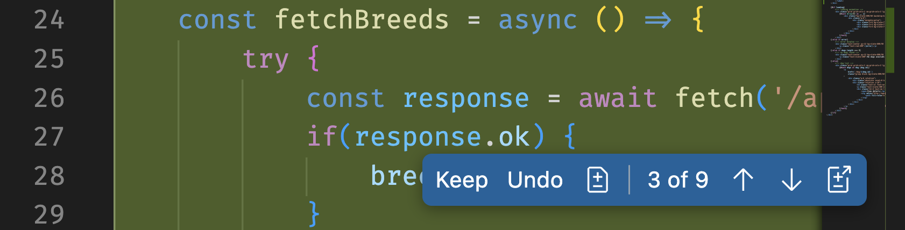
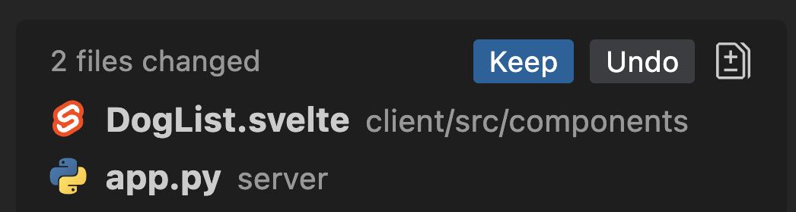

# Add the filter feature

| [← Providing custom instructions][walkthrough-previous] | [Next: Bonus content →][walkthrough-next] |
|:-----------------------------------|------------------------------------------:|

We've explored how we can use GitHub Copilot to explore our project and to provide context to ensure the suggestions we receive are to the quality we expect. Now let's turn our attention to putting all this prep work into action by generating new code! We'll use GitHub Copilot to aid us in adding functionality to our website.

## Scenario

The website currently lists all dogs in the database. While this was appropriate when the shelter only had a few dogs, as time has gone on the number has grown and it's difficult for people to sift through who's available to adopt. The shelter has asked you to add filters to the website to allow a user to select a breed of dog and only display dogs which are available for adoption.

## Copilot Edits

Previously we utilized Copilot chat, which is great for working with an individual file or asking questions about our code. However, many updates necessitate changes to multiple files throughout a codebase. Even a seemingly basic change to a webpage likely requires updating HTML, CSS and JavaScript files. Copilot Edits allows you to modify multiple files at once.

With Copilot Edits, you will add the files which need to be updated to the context. Once you provide the prompt, Copilot Edits will begin the updates across all files in the context. It also has the ability to create new files or add files to the context as it deems appropriate.

## Add the filters to the dog list page

Adding the filters to the page will require updating a minimum of two files - the Flask backend and the Svelte frontend. Fortunately, Copilot Edits can update multiple files! Let's get our page updated with the help of Copilot Edits.

> [!NOTE]
> Because Copilot Edits works best with auto-save enabled, we'll activate it. As we'll explore a little later in this exercise, Copilot Edits provides powerful tools to undo any changes you might not wish to keep.

1. Return to your IDE with your project open.
2. Close any tabs you have open inside your IDE.
3. Enable Auto Save by selecting **File** > **Auto Save**.
4. Open the following files in your IDE (which we'll point Copilot chat to for context):
   - **server/app.py**
   - **client/src/components/DogList.svelte** 
5. Select **Copilot Edits** in the Copilot Chat window.
6. If available, select **Claude 3.5 Sonnet** from the list of available models.
7. Select **Add Context...** in the chat window.
7. Select **Open Editors** from the prompt. This will add all currently open files to the context.
8. Ask Copilot to generate the update you want to the page, which is to add filters for both dog breed and if dogs are available for adoption. Use your own phrasing, ensuring the following requirements are met:
    - A dropdown list should be provided with all breeds
    - A checkbox should be available to only show available dogs
    - The page should automatically refresh whenever a change is made

> [!NOTE]
> You should use your own phrasing when generating the prompt. As highlighted previously, part of the exercise is to become comfortable creating prompts for GitHub Copilot. One key tip is it's always good to provide more guidance to ensure you get the code you are looking for.

Copilot begins generating the suggestions!

## Reviewing the suggestions

Unlike our prior examples where we worked with an individual file, we're now working with changes across multiple files - and maybe multiple sections of multiple files. Fortunately, Copilot Edits has functionality to help streamline this process.

GitHub Copilot will propose the following changes:

- Update the endpoint to list all dogs to accept parameters for breed and availability.
- Update the webpage to include the dropdown list and checkbox.

As the code is generated, you will notice the files are displayed using an experience similar to diff files, with the new code highlighted in green and old code highlighted in red (by default).

If you open an individual file, you can keep or undo changes by using the buttons provided.

You can also keep or undo all changes made.

And

1. Review the code suggestions to ensure they behave the way you expect them to, making any necessary changes. Once you're satisfied, you can select **Keep** on the files individually or in Copilot Chat to accept all changes.
2. Open the page at [http://localhost:4321][tailspin-shelter-website] to see the updates!
3. Run the Python tests by using `python -m unittest` in the terminal as you did previously.
4. If any changes are needed, explain the required updates to GitHub Copilot and allow it to generate the new code.

> [!IMPORTANT]
> Working iteratively a normal aspect of coding with an AI pair programmer. You can always provide more context to ensure Copilot understands, make additional requests, or rephrase your original prompts. To aid you in working iteratively, you will notice undo and redo buttons towards the top of the Copilot Edits interface, which allow you to move back and forth across prompts.
>
> 

5. Confirm the functionality works as expected, then select **Keep** to accept all the changes.
6. Optional: Disable Auto Save by unselecting **File** > **Auto Save**.

## Summary

You've worked with GitHub Copilot to add new features to the website - the ability to filter the list of dogs. With the help of Copilot Edits, you updated multiple files across the project, and iteratively built the desired functionality.

## Workshop review

Over the course of the workshop you explore the core functionality of GitHub Copilot. You saw how to use code completion to get inline suggestions, chat participants to explore your project, Copilot instructions to add context, and Copilot Edits to update multiple files.

There is no one right way to use GitHub Copilot. Continue to explore and try different prompts to discover what works best for your workflow and how GitHub Copilot can aid your productivity.

## Resources

- [Asking GitHub Copilot questions in your IDE][copilot-ask]
- [Copilot Chat cookbook][copilot-cookbook]
- [Copilot Edits][copilot-edits]

| [← Providing custom instructions][walkthrough-previous] | [Next: Bonus content →][walkthrough-next] |
|:-----------------------------------|------------------------------------------:|

[copilot-ask]: https://docs.github.com/en/copilot/using-github-copilot/copilot-chat/asking-github-copilot-questions-in-your-ide
[copilot-cookbook]: https://docs.github.com/en/copilot/copilot-chat-cookbook
[copilot-edits]: https://code.visualstudio.com/docs/copilot/copilot-edits
[tailspin-shelter-website]: http://localhost:4321
[walkthrough-previous]: ./3-copilot-instructions.md
[walkthrough-next]: ./5-bonus.md
