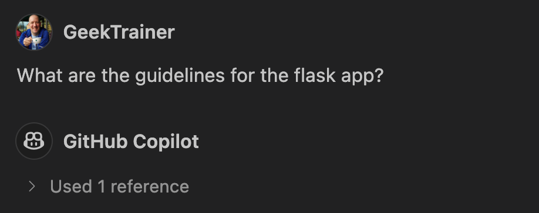

# Helping GitHub Copilot understand context

The key to success when coding (and much of life) is context. Before we add code to a codebase, we want to understand the rules and structures already in place. When working with an AI coding assistant such as GitHub Copilot the same concept applies - the quality of suggestion is directly proportional to the context Copilot has. Let's use this opportunity to both explore the project we've been given and how to interact with Copilot to ensure it has the context it needs to do its best work.

## Scenario

Before adding new functionality to the website, you want to explore the existing structure to determine where the updates need to be made. You also want to provide Copilot some context in the form of [custom instructions](https://docs.github.com/en/copilot/customizing-copilot/adding-repository-custom-instructions-for-github-copilot?tool=vscode) so it has a better idea of how best to generate code.

## Getting started with GitHub Copilot

GitHub Copilot is a cloud-based service offered for both individuals and businesses. As an individual, you can [sign up for a free account](https://github.com/github-copilot/signup) of the service. After enrolling you will typically install the extension for your IDE, which is available for [Visual Studio](https://marketplace.visualstudio.com/items?itemName=GitHub.copilotvs), [Visual Studio Code](https://marketplace.visualstudio.com/items?itemName=GitHub.copilot), [NeoVIM](https://github.com/github/copilot.vim#getting-started) and the [JetBrains IDEs](https://plugins.jetbrains.com/plugin/17718-github-copilot). Because we'll be using the [codespace](./3-codespaces.md) you defined in the previous exercise, you won't need to manually install the extension - you did that when you configured the dev container!

1. If you don't already have access to GitHub Copilot, [sign up for a free trial](https://github.com/github-copilot/signup).
2. In the [previous exercise](./3-codespaces.md) you configured your [devcontainer](https://docs.github.com/en/codespaces/setting-up-your-project-for-codespaces/adding-a-dev-container-configuration/introduction-to-dev-containers) to automatically install the extension for GitHub Copilot, so you're all set and ready to go!

## Chat participants and extensions

GitHub Copilot Chat has a set of available chat participants and extensions available to you to both provide instructions to GitHub Copilot and access external services. Chat participants are helpers which work inside your IDE and have access to your project, while extensions can call external services and provide information to you without having to open separate tools. We're going to focus on one core chat participant - `@workspace`.

`@workspace` creates an index of your project and allows you to ask questions about what you're currently working on, to find resources inside the project, or add it to the context. It's best to use this when the entirety of your project should be considered or you're not entirely sure where you should start looking. In our current scenario, since we want to ask questions about our project, `@workspace` is the perfect tool for the job.

> [!NOTE]
> This exercise doesn't provide specific prompts to type, as part of the learning experience is to discover how to interact with Copilot. Feel free to talk in natural language, describing what you're looking for or need to accomplish.

1. Return to your codespace, or reopen it by navigating to your repository and selecting **Code** > **Codespaces** and the name of your codespace.
2. Open GitHub Copilot Chat.
3. Select the `+` icon towards the top to begin a new chat.
4. Type `@workspace` in the chat prompt window and hit <kbd>tab</kbd> to select or activate it, then continue by asking Copilot about your project. You can ask what technologies are in use, what the project does, where functionality resides, etc.
5. Spend a few minutes exploring to find the answers to the following questions:
    - What frameworks are currently in use?
    - Where's the database the project uses?
    - How is the frontend built?
    - How is the backend built?
    - What files are involved in listing dogs?

## Providing custom instructions

Context is key to ensuring the code suggestions you receive from GitHub Copilot align with your expectations. When operating with limited information, Copilot makes assumptions about what you're looking for, and can sometimes guess incorrectly. By providing context, you allow Copilot to better align with your objectives. One great way to do this is by building a [copilot-instructions.md](https://docs.github.com/en/copilot/customizing-copilot/adding-repository-custom-instructions-for-github-copilot?tool=vscode) file. This markdown file is placed in your **.github** folder and becomes part of your project. You can use this file to indicate various coding standards you wish to follow, the technologies your project uses, or anything else important for Copilot Chat to understand when generating suggestions.

> [!IMPORTANT]
> The *copilot-instructions.md* file is included in **every** call to GitHub Copilot Chat, and will be part of the context sent to Copilot. Because there is always a limited set of tokens an LLM can operate on, a large set of Copilot instructions can obscure relevant information. As such, you should limit your Copilot instructions file to project-wide information, providing an overview of what you're building and how you're building it. If you need to provide more specific information for particular tasks, you can create [prompt files](https://docs.github.com/en/copilot/customizing-copilot/adding-repository-custom-instructions-for-github-copilot?tool=vscode#about-prompt-files) as needed.

Here are some guidelines to consider when creating a Copilot instructions file:

- The Copilot instructions file becomes part of the project, meaning it will apply to every developer; anything indicated in the file should be globally applicable.
- The file is markdown, so you can take advantage of that fact by grouping content together to improve readability.
- Provide overview of **what** you are building and **how** you are building it, including:
    - languages, frameworks and libraries in use.
    - required assets to be generated (such as unit tests) and where they should be placed.
    - any language specific rules such as:
        - Python code should always follow PEP8 rules.
        - use arrow functions rather than the `function` keyword.
- If you notice GitHub Copilot consistently provides an unexpected suggestion (e.g. using class components for React), add those notes to the instructions file.

Let's create a Copilot instructions file. Just as before, because we want you to explore and experiment, we won't provide exact directions on what to type, but will give enough context to create one on your own.

1. Create a new file in the **.github** folder called **copilot-instructions.md**.
2. Add the markdown to the file necessary to provide information about the project structure and requirements, including:
    - an overview of the project itself (based on the information you gathered earlier in this exercise).
    - the languages and frameworks in use to create both the server and client.
    - unit tests are required for routes in the Flask app, and must mock the database calls.
    - the website should be in dark mode and have a modern look and feel.
3. Save the file!

Your Copilot instructions file could resemble the following (but again - use your own words and style!):

```markdown
# Dog shelter

This is an application to allow people to look for dogs to adopt. It is built in a monorepo, with a Flask-based backend and Astro-based frontend.

## Backend

- Built using Flask and SQLAlchemy
- All routes require unit tests, which are created in *test_file.py* in the same folder as the file
- When creating tests, always mock database calls

## Frontend

- Built using Astro and Svelte
- Pages should be in dark mode with a modern look and feel
```

## Watch the instructions file in action

Whenever you make a call to Copilot chat, the response will always include the context being used. The context can automatically include the open file (focused on any code you highlight), and individual files or folders you add by using `#file` or `#folder`. You can also include the an index of your workspace by using `@workspace`, as highlighted earlier. The references dialog is a great way to check what information Copilot was using when generating its suggestions and response. Once you create a Copilot instructions file, you will see it's always included in the references section.

1. Close all files currently open in VS Code or your Codespace.
2. Select the `+` icon in GitHub Copilot chat to start a new chat.
3. Ask Copilot chat **What are the guidelines for the flask app?**
4. Note the references now includes the instructions file and provides information gathered from it.



## Summary and next steps

Congratulations! You've explored context in GitHub Copilot, which is key to generating quality suggestions. You saw how you can use chat participants to help guide GitHub Copilot, and create a Copilot instructions file to provide an overview of what you're building and how you're building it. With this in place, it's time to turn our attention to [adding new functionality to our website](./6-code.md)!

## Resources

- [Getting started with GitHub Copilot](https://docs.github.com/en/copilot/getting-started-with-github-copilot)
- [Adding repository custom instructions for GitHub Copilot](https://docs.github.com/en/copilot/customizing-copilot/adding-repository-custom-instructions-for-github-copilot)
- [Adding personal custom instructions for GitHub Copilot](https://docs.github.com/en/copilot/customizing-copilot/adding-personal-custom-instructions-for-github-copilot)
- [Copilot Chat cookbook](https://docs.github.com/en/copilot/copilot-chat-cookbook)
- [Use Copilot Chat in VS Code](https://code.visualstudio.com/docs/copilot/copilot-chat)
