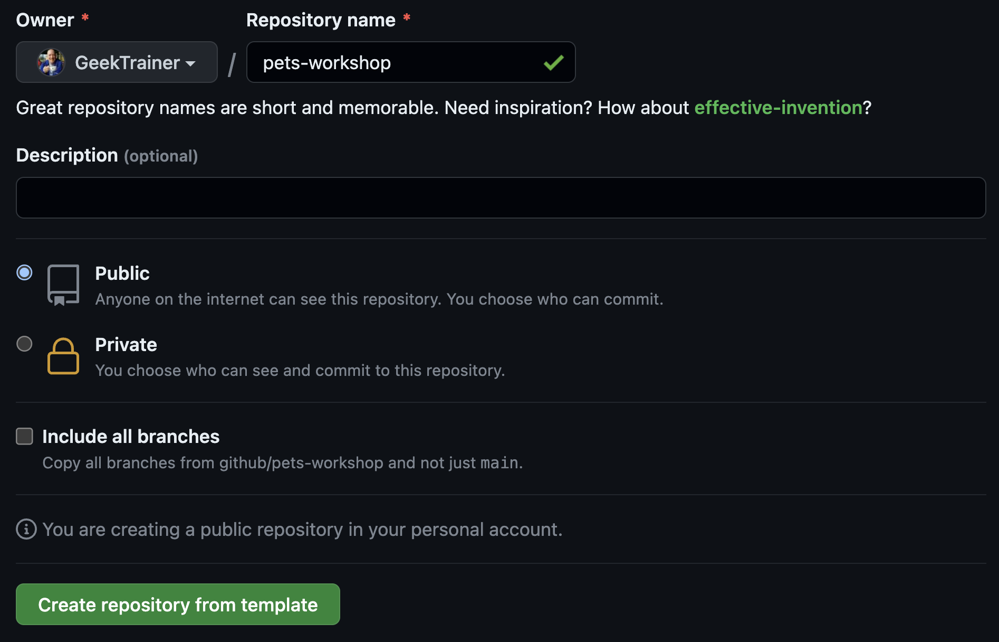

# Workshop setup

| [← Modern DevOps with GitHub][walkthrough-previous] | [Next: Enable Code Scanning →][walkthrough-next] |
|:-----------------------------------|------------------------------------------:|

To complete this workshop you will need to create a repository with a copy of the contents of this repository. While this can be done by [forking a repository][fork-repo], the goal of a fork is to eventually merge code back into the original (or upstream) source. In our case we want a separate copy as we don't intend to merge our changes. This is accomplished through the use of a [template repository][template-repo]. Template repositories are a great way to provide starters for your organization, ensuring consistency across projects.

The repository for this workshop is configured as a template, so we can use it to create your repository.

## Create your repository
Let's create the repository you'll use for your workshop.

1. Navigate to [the repository root][repo-root]
2. Select **Use this template** > **Create a new repository**
    
3. Under **Owner**, select the name of your GitHub handle, or the owner specified by your workshop leader.
4. Under **Repository**, set the name to **pets-workshop**, or the name specified by your workshop leader.
5. Ensure **Public** is selected for the visibility, or the value indicated by your workshop leader.
6. Select **Create repository from template**.
    

In a few moments a new repository will be created from the template for this workshop!

## Summary and next steps
You've now created the repository you'll use for this workshop! Next let's [enable Code Scanning][walkthrough-next] to secure the code we write.

| [← Modern DevOps with GitHub][walkthrough-previous] | [Next: Enable Code Scanning →][walkthrough-next] |
|:-----------------------------------|------------------------------------------:|

[fork-repo]: https://docs.github.com/en/get-started/quickstart/fork-a-repo
[template-repo]: https://docs.github.com/en/repositories/creating-and-managing-repositories/creating-a-template-repository
[repo-root]: /
[walkthrough-previous]: README.md
[walkthrough-next]: 1-code-scanning.md
