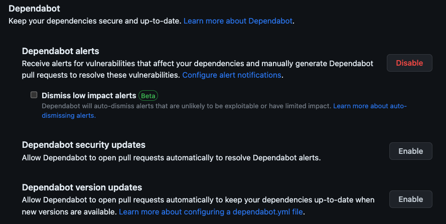
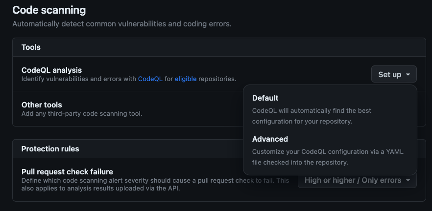
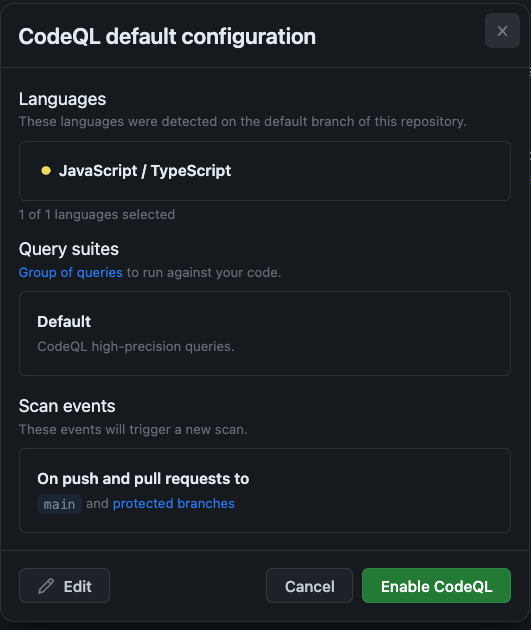

# Securing the development pipeline

| [← Workshop setup][walkthrough-previous] | [Next: Project management with GitHub Issues →][walkthrough-next] |
|:-----------------------------------|------------------------------------------:|

Ensuring code security is imperative in today's environment. When we think about how we create code today, there's three main areas to focus on:

- The code we write
- The code we use through libraries and packages
- The credentials needed to access services

To help support developers and security teams, [GitHub Advanced Security][advanced-security] provides a suite of tools which cover these focus areas. Code Scanning will check the code you write, Dependabot ensures the libraries you use are secure, and Secret Scanning looks for any keys or tokens which are checked into code.

Let's explore each of these, and enable them on our repository. We'll see them in action when we create a pull request with new code later in the workshop.

## Scenario

Security is important in every application. By detecting potential vulnerabilities early, teams are able to make updates before infiltrations occur. To help secure the website, the shelter wants to update the repository to ensure insecure code and libraries are detected as early as possible. You'll enable Dependabot, secret scanning, and code scanning to meet these needs.

## Dependabot

Most projects take dependencies on open source and other external libraries. While modern development would seemingly be impossible without these resources, we always need to ensure the dependencies we take are secure. [Dependabot][dependabot-quickstart] will look at the dependencies your repository has and raise alerts or even create [pull requests][about-prs] (PRs) to update your dependencies to a secure version.

### Configuring Dependabot

Public repositories on GitHub automatically have Dependabot alerts. This feature will generate alerts whenever an insecure package is detected, and generate an alert. Let's configure Dependabot to create PRs to update a library's version when an insecure one is detected.

1. Navigate to the repository you created for this workshop.
1. Select the **Settings** tab.
2. On the left side, select **Code security**.
3. Locate the **Dependabot** section towards the middle of the page:

    

4. Select **Enable** next to **Dependabot security updates** to configure Dependabot to create PRs to resolve alerts.

You have now enabled Dependabot alerts and security updates! Should an insecure library be detected, you will both receive an alert, and Dependabot will create a new pull request to update the version number to a secure version of the library.

> **IMPORTANT:** After enabling Dependabot security updates you may notice new [pull requests](https://docs.github.com/en/pull-requests/collaborating-with-pull-requests/proposing-changes-to-your-work-with-pull-requests/about-pull-requests) created for potentially outdated packages. For this workshop you can ignore these pull requests.

## Secret scanning

Many developers have checked in code with a token or username and passwords. Sometimes this is because the developer was trying to take a shortcut, sometimes it was because they didn't know the proper mechanism to secure the key, and sometimes it was done under the assumption they'll clean it up later but never do.

Regardless of the reason, even seemingly innocuous tokens can create a security issue. We always want to take care to not publish tokens and keys, and detect any issues as quickly as possible. Secret scanning is built to do exactly this. When a token is detected in your source code, an alert will be raised. You can even enable push protection, ensuring any code with a [supported secret](https://docs.github.com/en/code-security/secret-scanning/secret-scanning-patterns#supported-secrets) can't be pushed to your repository.

### Enabling secret scanning

Let's enable Secret scanning to detect any potential keys.

1. On the same page (**Settings** > **Code security and analysis**), towards the very bottom, locate the **Secret scanning** section.
1. Next to **Receive alerts on GitHub for detected secrets, keys or other tokens**, select **Enable**.
1. Next to **Push protection**, select **Enable** to block pushes to the repository which contain a [supported secret](https://docs.github.com/en/code-security/secret-scanning/secret-scanning-patterns#supported-secrets).

    

You've now enabled secret scanning and push protection. This helps you both block keys from being pushed to your repository and quickly detect when a key has been added to your source code.

## Code scanning

There is a direct relationship between the amount of code an organization creates and potential attack vectors. We always want to check our source code for vulnerabilities. [Code scanning](https://docs.github.com/en/code-security/code-scanning/automatically-scanning-your-code-for-vulnerabilities-and-errors/about-code-scanning) checks your source code for known vulnerabilities. When an issue is detected on a pull request, a new comment is added highlighting the line of source code providing contextual information for the developer. This allows for the issue to be quickly resolved.

> [!NOTE]
> Code scanning is built atop [GitHub Actions](https://github.com/features/actions), the automation platform for GitHub. We'll explore the specifics of GitHub Actions later in this workshop and create our own workflows.

### Enabling code scanning

Let's enable Code scanning to detect vulnerabilities in our source code. We're going to use the default implementation, which runs whenever code is pushed to `main` or a [pull request](https://docs.github.com/en/pull-requests/collaborating-with-pull-requests/proposing-changes-to-your-work-with-pull-requests/about-pull-requests) is made to `main`. It will also run on a set schedule to ensure any newly discovered potential vulnerabilities are detected.

1. On the same page (**Settings** > **Code security and analysis**), towards the very bottom, locate the **Code scanning** section.
1. Next to **CodeQL analysis**, select **Set up** > **Default**.

    

1. On the **CodeQL default configuration** dialog, select **Enable CodeQL**.

    

> [!IMPORTANT]
> Your list of languages may be different

A background process starts, and will configure a workflow for analyzing your code using [CodeQL and code scanning](https://docs.github.com/en/code-security/code-scanning/automatically-scanning-your-code-for-vulnerabilities-and-errors/about-code-scanning).

## Summary and next steps

In this exercise, you enabled GitHub Advanced Security. You enabled Dependabot to check the libraries your project takes dependencies on, secret scanning to look for keys and tokens, and code scanning to examine your source code. These tools help ensure your application is secure. Next it's time to [file an issue][walkthrough-next] to add feature requests.

### Additional resources

- [About GitHub Advanced Security][advanced-security-docs]
- [GitHub Skills: Secure your repository's supply chain][skills-supply-chain]
- [GitHub Skills: Secure code game][skills-secure-code]

| [← Workshop setup][walkthrough-previous] | [Next: Project management with GitHub Issues →][walkthrough-next] |
|:-----------------------------------|------------------------------------------:|

[advanced-security]: https://github.com/features/security
[advanced-security-docs]: https://docs.github.com/en/get-started/learning-about-github/about-github-advanced-security
[about-prs]: https://docs.github.com/en/pull-requests/collaborating-with-pull-requests/proposing-changes-to-your-work-with-pull-requests/about-pull-requests
[dependabot-quickstart]: https://docs.github.com/en/code-security/getting-started/dependabot-quickstart-guide
[skills-supply-chain]: https://github.com/skills/secure-repository-supply-chain
[skills-secure-code]: https://github.com/skills/secure-code-game
[walkthrough-previous]: 0-setup.md
[walkthrough-next]: 2-issues.md
