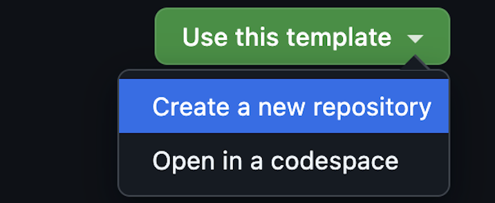
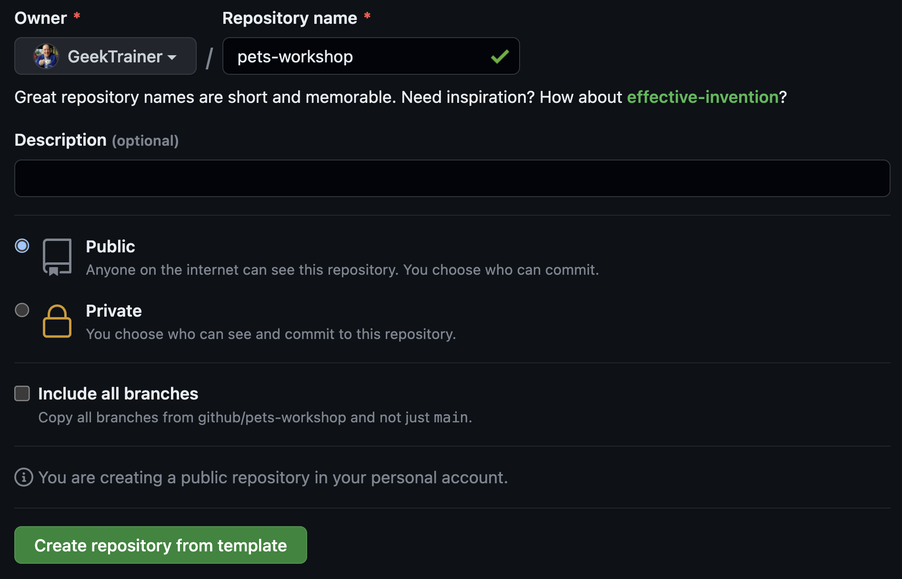

# Workshop Setup

| [← GitHub Actions: From CI to CD][walkthrough-previous] | [Next: Introduction & Your First Workflow →][walkthrough-next] |
|:-----------------------------------|------------------------------------------:|

To complete this workshop you will need to create a repository with a copy of the contents of this repository. While this can be done by [forking a repository][fork-repo], the goal of a fork is to eventually merge code back into the original (or upstream) source. In our case we want a separate copy as we don't intend to merge our changes. This is accomplished through the use of a [template repository][template-repo]. Template repositories are a great way to provide starters for your organization, ensuring consistency across projects.

The repository for this workshop is configured as a template, so we can use it to create your repository.

## Create your repository

Let's create the repository you'll use for your workshop.

1. Navigate to [the repository root][repo-root]
2. Select **Use this template** > **Create a new repository**

    

3. Under **Owner**, select the name of your GitHub handle, or the owner specified by your workshop leader.
4. Under **Repository**, set the name to **pets-workshop**, or the name specified by your workshop leader.
5. Ensure **Public** is selected for the visibility, or the value indicated by your workshop leader.
6. Select **Create repository from template**.

    

In a few moments a new repository will be created from the template for this workshop!

## Open your codespace

Now let's open a codespace so you have a development environment ready to go.

1. Navigate to the main page of your newly created repository.
2. Select **Code** > **Codespaces** > **Create codespace on main**.

    In a few moments a codespace will open in your browser with a full VS Code editor. This is where you'll create and edit files throughout the workshop.

> [!TIP]
> If your codespace ever disconnects or you close the tab, you can reopen it by navigating to your repository and selecting **Code** > **Codespaces** and the name of your codespace.

## Summary and next steps

You've created the repository and opened a codespace — you're ready to start building! Next let's [create your first workflow][walkthrough-next].

| [← GitHub Actions: From CI to CD][walkthrough-previous] | [Next: Introduction & Your First Workflow →][walkthrough-next] |
|:-----------------------------------|------------------------------------------:|

[fork-repo]: https://docs.github.com/get-started/quickstart/fork-a-repo
[template-repo]: https://docs.github.com/repositories/creating-and-managing-repositories/creating-a-template-repository
[repo-root]: /
[walkthrough-previous]: README.md
[walkthrough-next]: 1-introduction.md
