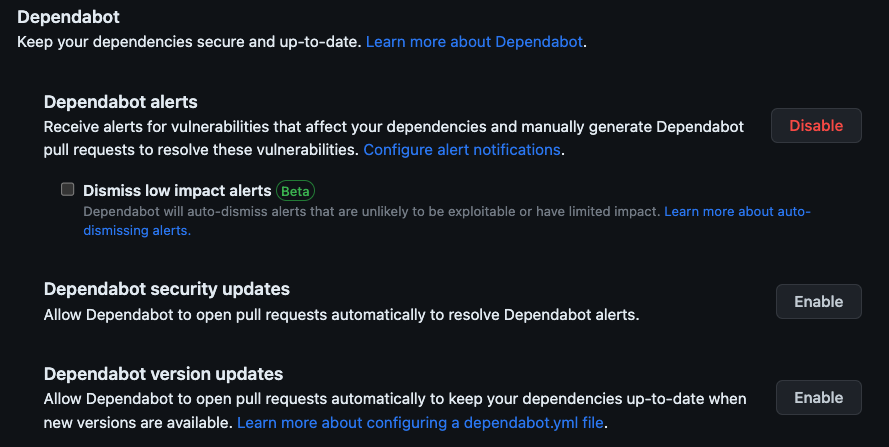
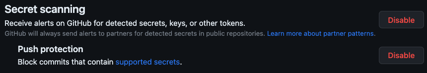
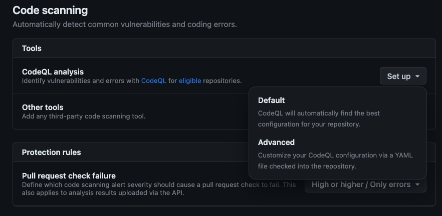
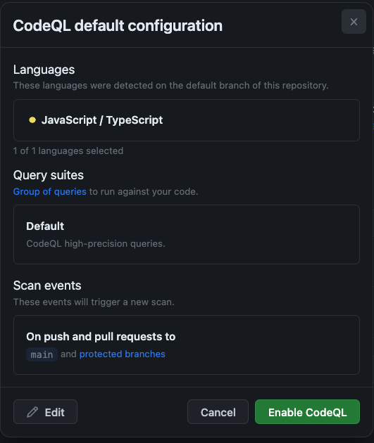

# Securing the Development Pipeline

| [← Introduction & Your First Workflow][walkthrough-previous] | [Next: Running Tests →][walkthrough-next] |
|:-----------------------------------|------------------------------------------:|

In the previous exercise you created your first GitHub Actions workflow — a manually triggered "Hello World." Before building out CI/CD, let's explore security. Ensuring code security is imperative in today's environment, and GitHub provides tools that automate this for you — many of which are powered by GitHub Actions under the hood.

When we think about how we create code today, there are three main areas to secure:

- The **code we write** — which may contain vulnerabilities
- The **libraries we use** — which may have known security issues
- The **credentials we manage** — which may accidentally leak into source code

[GitHub Advanced Security][advanced-security] provides a suite of tools covering each of these areas. Let's explore and enable them on our repository.

## Scenario

Security is important in every application. By detecting potential vulnerabilities early, teams can make updates before incidents occur. The shelter wants to ensure insecure code and libraries are detected as early as possible. You'll enable Dependabot, secret scanning, and code scanning to meet these needs.

## Background

[GitHub Advanced Security][advanced-security-docs] is a set of security features available directly in GitHub. The three pillars are:

- **Code scanning** analyzes your source code for security vulnerabilities using [CodeQL][about-code-scanning], GitHub's semantic code analysis engine. When enabled, it runs as a GitHub Actions workflow — the same automation platform you used in the previous exercise. Every push and pull request triggers the analysis automatically.
- **Dependabot** monitors your project's dependencies for known vulnerabilities and can automatically create [pull requests][about-prs] to update insecure packages to safe versions.
- **Secret scanning** detects tokens, keys, and other credentials that have been committed to your repository, and can block pushes that contain [supported secrets][supported-secrets].

> [!NOTE]
> Code scanning is built on [GitHub Actions][github-actions]. When you enable CodeQL's default setup, GitHub creates and manages a workflow for you behind the scenes. You'll see this connection more clearly when you navigate to the **Actions** tab after enabling it. This is a great example of how Actions powers automation across the GitHub platform — not just CI/CD pipelines you write yourself.

## Configure Dependabot

Most projects depend on open source and external libraries. While modern development would be impossible without them, we always need to ensure the dependencies we use are secure. [Dependabot][dependabot-quickstart] monitors your repository's dependencies and raises alerts — or even creates pull requests — to update insecure packages.

Public repositories on GitHub automatically have Dependabot alerts enabled. Let's configure Dependabot to also create PRs that update insecure library versions automatically.

1. Navigate to your repository on GitHub.
2. Select **Settings** > **Code security** (under **Security** in the sidebar).
3. Locate the **Dependabot** section.

    

4. Select **Enable** next to **Dependabot security updates** to configure Dependabot to create PRs to resolve alerts.

You've now enabled Dependabot alerts and security updates! When an insecure library is detected, you'll receive an alert, and Dependabot will create a pull request to update to a secure version.

> [!TIP]
> Dependabot doesn't just alert you — it can automatically create pull requests that bump library versions to secure ones. When you pair this with a CI pipeline that runs tests on every PR (which you'll build in the [next exercise][walkthrough-next]), those Dependabot PRs are automatically tested before merging. This creates a powerful feedback loop: vulnerabilities are detected, fixes are proposed, and your tests verify the update won't break anything — all without manual intervention.

> [!IMPORTANT]
> After enabling Dependabot security updates you may notice new pull requests created for potentially outdated packages. For this workshop you can ignore these pull requests.

## Enable secret scanning

Many developers have accidentally checked in code containing tokens or credentials. Regardless of the reason, even seemingly innocuous tokens can create a security issue. [Secret scanning][about-secret-scanning] detects tokens in your source code and raises alerts. With push protection enabled, pushes containing supported secrets are blocked before they reach your repository.

1. On the same **Code security** settings page, locate the **Secret scanning** section.
2. Next to **Receive alerts on GitHub for detected secrets, keys or other tokens**, select **Enable**.
3. Next to **Push protection**, select **Enable** to block pushes containing a [supported secret][supported-secrets].

    

You've now enabled secret scanning and push protection — helping prevent credentials from reaching your repository.

## Enable code scanning

There is a direct relationship between the amount of code an organization writes and its potential attack surface. [Code scanning][about-code-scanning] analyzes your source code for known vulnerabilities. When an issue is detected on a pull request, a comment is added highlighting the affected line with contextual information for the developer.

Let's enable code scanning with the default CodeQL setup. This runs automatically whenever code is pushed to `main` or a pull request targets `main`, and on a regular schedule to catch newly discovered vulnerabilities.

1. On the same **Code security** settings page, locate the **Code scanning** section.
2. Next to **CodeQL analysis**, select **Set up** > **Default**.

    

3. On the **CodeQL default configuration** dialog, select **Enable CodeQL**.

    

> [!IMPORTANT]
> Your list of languages may be different from what's shown in the screenshot.

A background process starts and configures a CodeQL analysis workflow for your repository.

> [!TIP]
> After enabling CodeQL, navigate to the **Actions** tab in your repository. You'll see a new **CodeQL** workflow listed alongside the **Hello World** workflow you created earlier. This is the Actions workflow that GitHub created automatically to run code scanning — proof that Actions isn't just for CI/CD, but powers many of GitHub's built-in features.

## Summary and next steps

You've enabled GitHub Advanced Security for your repository:

- **Dependabot** monitors dependencies for known vulnerabilities and creates PRs to update them.
- **Secret scanning** detects leaked credentials and blocks pushes containing supported secrets.
- **Code scanning** analyzes your source code using CodeQL, running as a GitHub Actions workflow on every push and PR.

These tools run automatically in the background, catching security issues before they reach production. Now that you've seen how GitHub uses Actions internally for security automation, it's time to build your own CI workflow. Next, we'll [automate testing][walkthrough-next] for the shelter's application.

## Resources

- [About GitHub Advanced Security][advanced-security-docs]
- [About code scanning with CodeQL][about-code-scanning]
- [Dependabot quickstart guide][dependabot-quickstart]
- [About secret scanning][about-secret-scanning]
- [GitHub Skills: Secure your repository's supply chain][skills-supply-chain]
- [GitHub Skills: Secure code game][skills-secure-code]

| [← Introduction & Your First Workflow][walkthrough-previous] | [Next: Running Tests →][walkthrough-next] |
|:-----------------------------------|------------------------------------------:|

[about-code-scanning]: https://docs.github.com/code-security/code-scanning/introduction-to-code-scanning/about-code-scanning
[about-prs]: https://docs.github.com/pull-requests/collaborating-with-pull-requests/proposing-changes-to-your-work-with-pull-requests/about-pull-requests
[about-secret-scanning]: https://docs.github.com/code-security/secret-scanning/introduction/about-secret-scanning
[advanced-security]: https://github.com/features/security
[advanced-security-docs]: https://docs.github.com/get-started/learning-about-github/about-github-advanced-security
[dependabot-quickstart]: https://docs.github.com/code-security/getting-started/dependabot-quickstart-guide
[github-actions]: https://github.com/features/actions
[supported-secrets]: https://docs.github.com/code-security/secret-scanning/introduction/supported-secret-scanning-patterns
[skills-supply-chain]: https://github.com/skills/secure-repository-supply-chain
[skills-secure-code]: https://github.com/skills/secure-code-game
[walkthrough-previous]: 1-introduction.md
[walkthrough-next]: 3-running-tests.md
